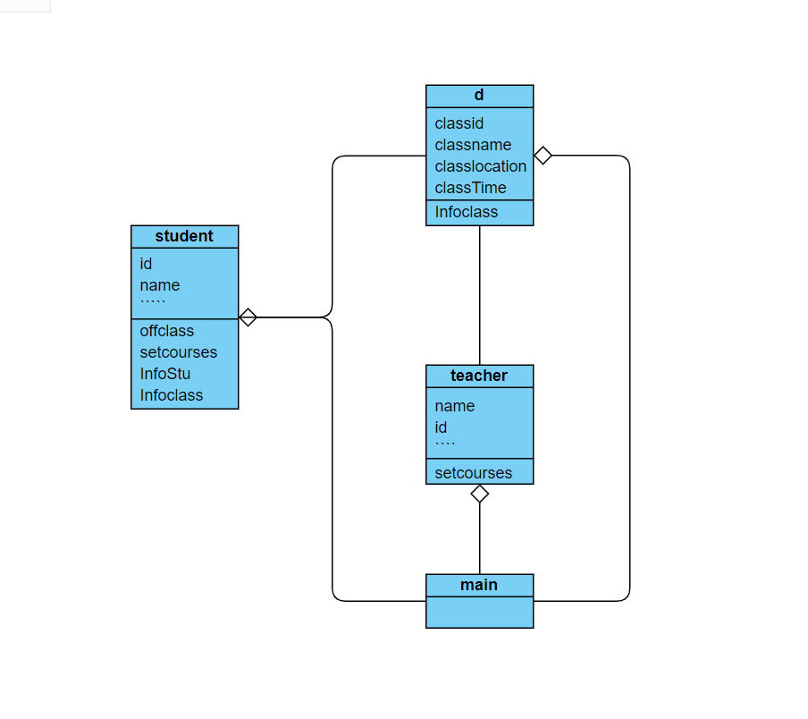

# ExperimentForJavaclass
This repository is for the second java class

实验目的：了解系统的需求，从学生选课系统了解对象的关系，以及定义类中的属性和方法。
面向对象、构造函数、实例化

实验要求：实例化多个类实体：
    1.教师类，并且使课程类的属性中包含老师的信息
    2.学生类方法，选课退课
    3.打印学生课表信息，还是属于学生类但是需要从学生类中创建课程类对象。

编写过程：
    1.first create the basic information for courses,teacher,student class;containing Properties of class, basic get() method for Properties.
    2.second create courses Prepared statement（引用对象）in teacher and student class for setCourses method.
    3.create offclass method for student
    4.create instantiation object in main and run.

流程图：
做了一个简易的UMl，感觉相比流程图这个更清楚点，不过因为现在的代码本身就没多复杂所以看起来很简单

核心代码：
我想应该主要是实例化的过程，main里面的代码都算核心代码吧，我也在每个java文件中标注了
student stu1=new student();
teacher teacher1=new teacher();
courses[] cou=new courses[3];

系统运行结果：
create course success!
id:4536251	name:Luoxing	teacherAddress:Peijing	Rank:Professor	Age:45
ID:cs101	CourseName:java	CourseLocation:bulding1	CourseTime:Thu Sep 29 16:00:01 CST 2022	teacher:Luoxing
ID:cs102	CourseName:python	CourseLocation:bulding2	CourseTime:Thu Sep 29 16:00:01 CST 2022	teacher:Luoxing
id:2018310905	name:chien	sexual:male	birthday:Sat Apr 08 16:00:01 CST 2000	DateOfschool:Sat Oct 09 16:00:01 CST 2021	address:Yuzhi Kyoto	iddress:Ganzhou
ID:cs101	CourseName:java	CourseLocation:bulding1	CourseTime:Thu Sep 29 16:00:01 CST 2022	teacher:Luoxing
ID:cs102	CourseName:python	CourseLocation:bulding2	CourseTime:Thu Sep 29 16:00:01 CST 2022	teacher:Luoxing
remove course sucess!
ID:cs102	CourseName:python	CourseLocation:bulding2	CourseTime:Thu Sep 29 16:00:01 CST 2022	teacher:Luoxing

感想：
这里有一些可以说的，就是在写这个的过程中，想到可以改进的更好的地方，但因为时间原因，还有涉及到其他库方法的复杂程度，还是尽量简化了一下，之后再做研究，这我觉得能考虑到这点也算是我对自己代码的一种“思考”了
这里我想到了思路以及在main中编写了一部分参考

(1)学生选课这个程序是一个双向的程序，也就意味着，在课程类里面需要有学生类的引用，来记录这门课一共有多少个学生，以及学生类里课程类的引用，来记录一个学生选择了多少门课程，这两个方法本质上还是相同的。同样的老师类中也可以创建课程类来达到语义上“老师开设课程”的效果，但在这次实验中还是实用的先课程类的对象，再将课程类的对象添加进老师的对象中，或者是将老师类的属性添加进课程中。逻辑上是后者更清晰一些，但语义上是前者更好。
(2)还有一些将main中的方法更加人性化的细节，比如多打印一些提示语，并且用input来控制对象属性。以及包括对象集合的处理，怎么从其中一堆课程中挑出指定课程删除，怎么指定添加，这些细节都能写的更丰富一些。
(3)其次就是复杂程度了，虽然这次实验中复杂程度应该就是n（for循环），但还是得多养成习惯注意这方面才能写出更优化的代码。